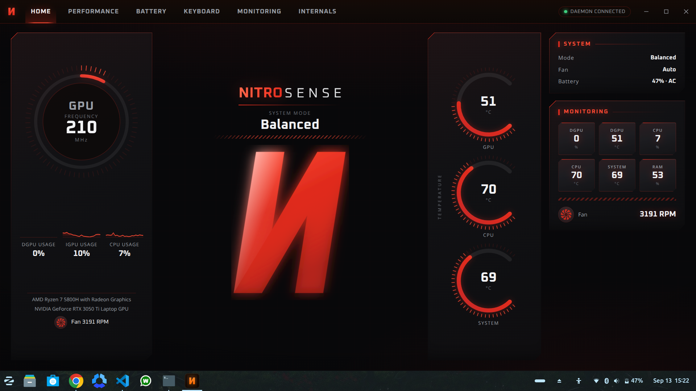
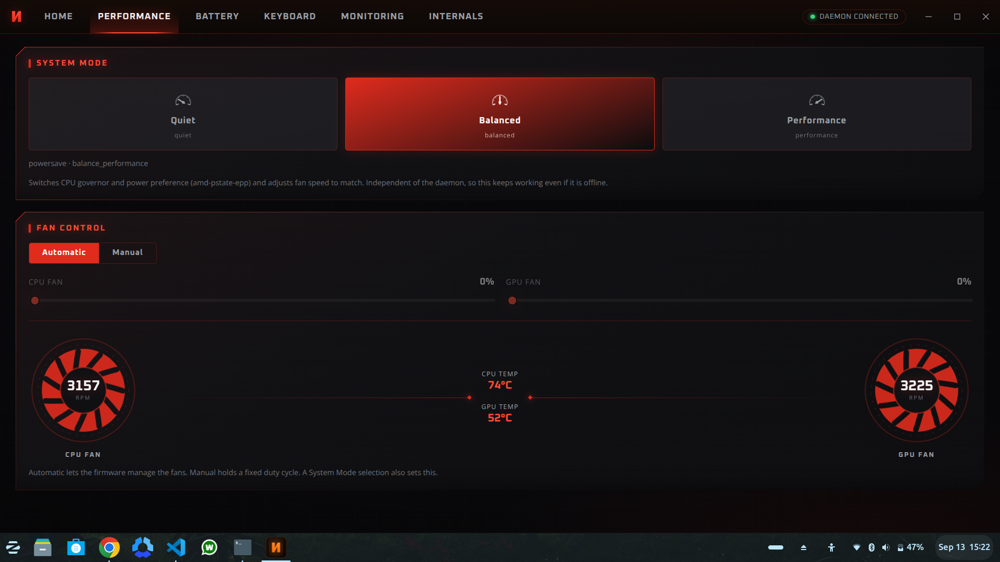
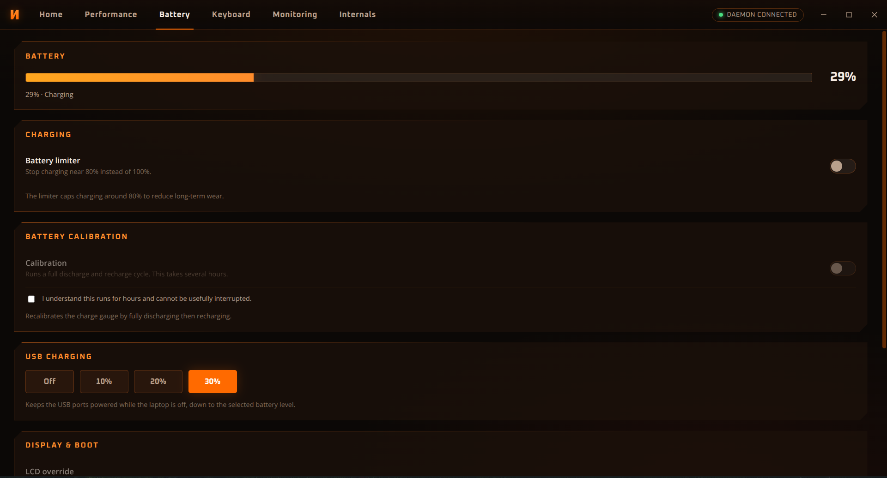
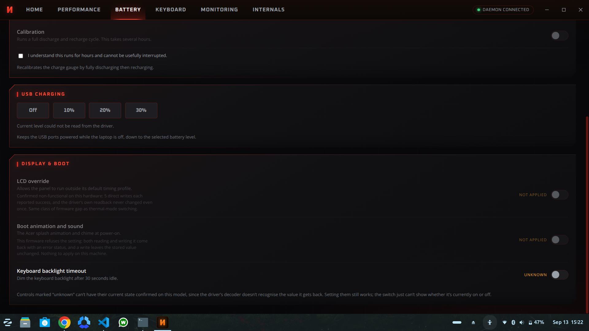
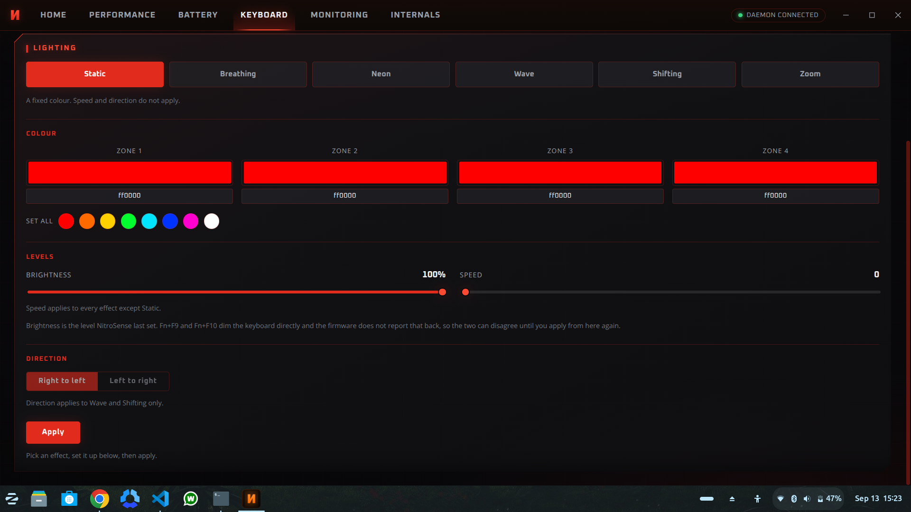
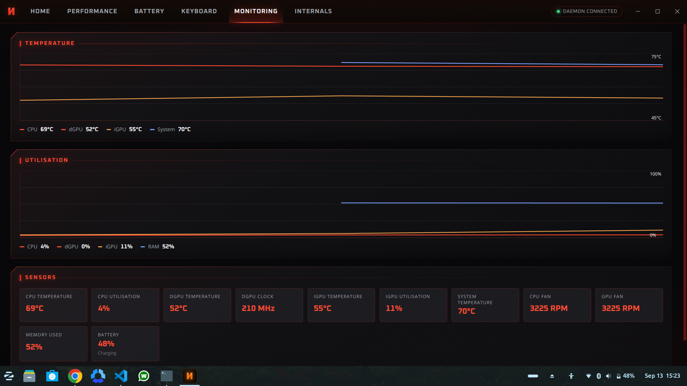
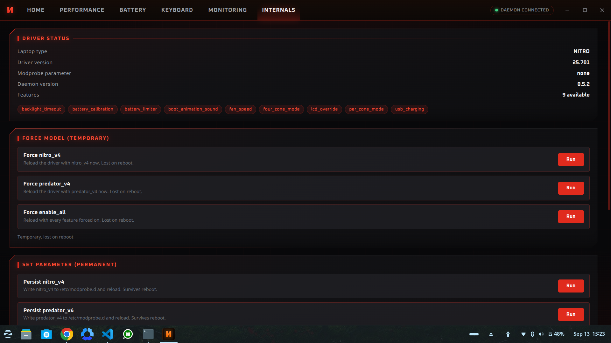

# NitroSense for Linux

NitroSense on Windows does fan control, power modes and keyboard lighting.
On Linux you get none of it. This brings it back.



> ⚠️ **Built and tested on the Acer Nitro AN515-45 only.**
> Other Nitro models may work but nothing here is tested on them.
>
> ⚠️ **Needs Linux 6.14 or newer.** Check with `uname -r`. Ubuntu 24.04 ships
> 6.8, which is too old; see [Install](#-install) for the one command that
> fixes it.

## 💻 Tested on

| | |
|---|---|
| Laptop | Acer Nitro AN515-45 |
| BIOS | V1.14 |
| CPU | AMD Ryzen 7 5800H (Radeon integrated) |
| GPU | NVIDIA RTX 3050 Ti (hybrid, display runs off the AMD side) |
| Kernel | 7.0.0-31-generic |
| OS | Zorin OS |
| Desktop | GNOME on Wayland |
| Kernel driver | linuwu_sense 25.701, patched |

### Will it work on mine?

Check your model first:

```bash
cat /sys/class/dmi/id/product_name
```

- **Nitro AN515-45** 👉 tested, works as described
- **AN515-46, AN515-58, AN517-54, AN16-41, AN16-43, ANV15-41, ANV15-51**
  👉 good chance, the driver already recognises these
- **Other models in the list below** 👉 same lighting hardware, but the driver
  needs a quirk entry adding for yours first
- **Predator or other Acer** 👉 no idea, nothing to go on

### 🧩 Models with the same keyboard hardware

Only the AN515-45 has been tested, and only that one is claimed to work. But
Acer's own Windows installer ships a per-model config, and every model below
declares identical keyboard lighting: `LightingType Type:1`, four zones, no
per-key. So the lighting side of this has a fair chance on any of them.

```
AN515-43   AN515-44   AN515-45   AN515-46   AN515-47   AN515-51s
AN515-54   AN515-55   AN515-56   AN515-57   AN515-58
AN517-41   AN517-42   AN517-43   AN517-51   AN517-52
AN517-53   AN517-54   AN517-55
AN715-41   AN715-51   AN715-52
```

That is a statement about the hardware, not a promise about the software. Fan
control, power modes and battery limits go through different firmware calls and
may behave differently on any of them.

### 🔧 Adding your model

Two things decide whether the keyboard lighting works: the driver needs a DMI
entry for your model, and the Fn key has to report a keycode the desktop can
see. Both are covered in `patches/` for the AN515-45, and the DMI entry is a
few lines.

Find your product name:

```bash
cat /sys/class/dmi/id/product_name
```

Then copy the `quirk_acer_nitro_an515_45` block and its `dmi_system_id` entry in
`patches/linuwu-sense-an515-45-rgb.patch`, changing the name to match. If the
four-zone files appear under
`/sys/devices/platform/acer-wmi/four_zoned_kb/` after a rebuild, it worked.

A pull request adding your model is welcome, though nobody here can test it.

### Needs

The installer checks all of this on your machine and tells you what is
missing, with the command to fix it. Nothing here has to be sorted out first.

**Required**, and pulled in automatically by `apt`:

- `python3`, for the background service
- `gcc` and `make`, to build the driver
- `policykit-1`, so the app can offer to start the service for you

**Required, but you have to install it yourself:**

```bash
sudo apt install linux-headers-$(uname -r)
```

The package name carries your kernel version, so it cannot be a fixed
dependency. Without it the app installs and runs, but every hardware control
shows as unavailable until the driver can be built.

**Optional:**

- the NVIDIA driver, for discrete GPU temperature, clock and utilisation.
  Without it those readings stay blank; everything else is unaffected, and the
  integrated GPU is read straight from sysfs.

**Also:**

- a GNOME based desktop for the NitroSense key shortcut (the rest works
  anywhere)
- Secure Boot off, or the module signed yourself, since it is out of tree

If something was missing at install time, fix it and then rebuild the driver:

```bash
sudo dpkg-reconfigure nitrosense
```


## ✨ What works

| Feature | Status |
|---|---|
| 🌀 Fan control (auto and manual) | works |
| ⚡ Power modes (Quiet / Balanced / Performance) | works |
| 🔋 Battery limit at 80% | works |
| 🔌 USB charging while the lid is shut | works |
| ⌨️ Keyboard RGB, per zone and 6 effects | works |
| 💾 Lighting comes back after a reboot | works |
| 🌡️ Live temps, fan RPM, CPU and GPU usage | works |
| 🎹 NitroSense key opens the app | works |

## 🚫 What does not work on this model

These were tested properly and they are firmware limits, not bugs in the app.
The app shows them as unavailable instead of pretending.

- **Thermal profiles** through ACPI. The firmware accepts the write and ignores
  it. Power modes use the CPU governor instead, which does work.
- **LCD override.** Writes report success, the value never changes.
- **Boot animation and sound.** The firmware refuses both reading and writing.
- **Reading the Fn brightness level.** Fn+F9 and Fn+F10 work, they are handled
  in the embedded controller. But the controller does not tell the firmware,
  and the firmware is all the driver can read, so the number in the app is the
  level it last set rather than what is lit. Setting brightness from the app
  still works.

## 📸 Screenshots

All taken on the AN515-45 with the daemon connected.

**Performance.** Power mode and fan control. Manual holds a fixed duty cycle,
automatic hands the fans back to the firmware.



**Battery.** Charge limiter, calibration and USB charging while the lid is shut.



**Keyboard.** Per zone colour across the four zones, with a preview and a
brightness slider.



**Keyboard effects.** Six effects with speed and direction. Direction only
applies to Wave and Shifting.



**Monitoring.** Temperature and utilisation over time for the CPU, both GPUs
and memory, plus every sensor the machine exposes.



**Internals.** Driver status, which features the firmware actually offers, and
the modprobe parameter controls. Useful when something is not behaving.



**Splash.** What you see after pressing the NitroSense key, while it connects.


## 📦 Install

Grab the `.deb` from [Releases](../../releases) and install it:

```bash
sudo apt install ./nitrosense_*_amd64.deb
```

That is all. The installer builds the kernel driver for your kernel, registers
it with DKMS so it gets rebuilt whenever you install a new kernel, sets the
background service to start at boot, and adds the app to your menu.

You need kernel headers, gcc and make. On Ubuntu based systems:

```bash
sudo apt install linux-headers-$(uname -r) build-essential
```

### You need kernel 6.14 or newer

Check with `uname -r`. The driver uses a kernel interface that only exists
from 6.14, so on anything older it cannot build at all. There is no way round
this from our side.

Ubuntu 24.04 ships 6.8 by default, which is too old. The newer kernel is one
package away:

```bash
sudo apt install linux-generic-hwe-24.04
```

Reboot into it and the driver builds by itself. The installer checks this and
tells you if your kernel is too old, rather than leaving you with a page of
compiler errors.

### If the install fails downloading something

apt pulls in `dkms` and the kernel headers alongside the app, and it gives up
on the whole install if it cannot download them. So a slow or unreachable
mirror looks like the app failing to install when nothing is wrong with it.

If you see connection timeouts, try forcing IPv4:

```bash
sudo apt -o Acquire::ForceIPv4=true install ./nitrosense_*_amd64.deb
```

If you have no network at all, this skips the extras and installs anyway:

```bash
sudo apt install --no-install-recommends ./nitrosense_*_amd64.deb
```

The app still works that way. You only lose the automatic rebuild on kernel
updates, so install `dkms` later and run `sudo dpkg-reconfigure nitrosense`.

### Secure Boot

Secure Boot only loads kernel modules signed with a key your machine trusts,
and this one is compiled on your machine, so it is not signed by anyone yet.
If the driver builds but will not load, that is usually why. The installer
tells you when it detects this. You can either enrol a signing key, which
`dkms` and `shim-signed` set up and prompt you for at the next reboot, or turn
Secure Boot off in the firmware settings.

### First launch

1. Open **NitroSense** from your app menu
2. It asks if you want your NitroSense key to open the app
3. Press the key once, it remembers, done
4. It never asks again

### Uninstall

```bash
sudo apt remove nitrosense
```

This puts the stock `acer_wmi` driver back so your hotkeys keep working.

## 🔨 Build it yourself

```bash
cd app
npm install
npm run package
```

The `.deb` lands in `app/release/`.

To run from source without installing:

```bash
cd app
./scripts/start-all.sh
```

One command, brings up the driver, the service and the app together. Nothing
persists, a reboot clears it. Good for testing.

Full build, test, release and cleanup steps are in [BUILDING.md](BUILDING.md).

## 🔦 Keyboard stuck dark?

This should not happen any more. The usual cause was the driver never
switching the keyboard panel on, so every colour write was accepted and lit
nothing, and it is fixed in `patches/`. If you are on an older build, or
another Nitro model that still does it, here is the way out.

The EC hands the lighting to software on the first write, through a flag
called PSEE, and nothing ever gives it back. That is why the dark survives a
reboot.

Two ways out. The simple one, no tools:

1. Shut down, not reboot
2. Unplug the charger
3. Hold the power button 30 seconds with no power connected
4. Plug in and boot

Or clear the flag directly, which works without a power cycle:

```bash
sudo modprobe ec_sys write_support=1
printf '\x21' | sudo dd of=/sys/kernel/debug/ec/ec0/io bs=1 seek=3 count=1 conv=notrunc
```

That clears bit 4 of EC byte 0x03 and the EC takes the keyboard back, lighting
it its own red. Picking any effect in the app hands control back to software.

## 🐛 Something broken?

Logs live here:

```bash
journalctl -u nitrosense-daemon -n 50     # background service
cat app/logs/launch.log                   # when the key does nothing
```

Check the driver loaded and found your keyboard:

```bash
ls /sys/module/linuwu_sense/drivers/platform:acer-wmi/acer-wmi/
```

You should see `nitro_sense` and `four_zoned_kb` in there.

## 🔧 About the keyboard lighting

RGB did not work at first. The driver was sending an 8 byte payload where this
firmware wants 4, so every write came back successful and did nothing at all.
Fixed in `patches/`, along with a model entry so the lighting shows up without
forcing flags that break the Fn keys.

Six effects, which is all the firmware actually has: static, breathing, neon,
wave, shifting, zoom.

## 📄 Licence

The app and the packaging are MIT. See `LICENSE`.

Two pieces it builds on keep their own licences, because they are not mine to
relicense:

- the `linuwu_sense` kernel driver, GPL-2.0, patched for this model
  (see `patches/` for what changed)
- the Python hardware service, GPL-3.0
